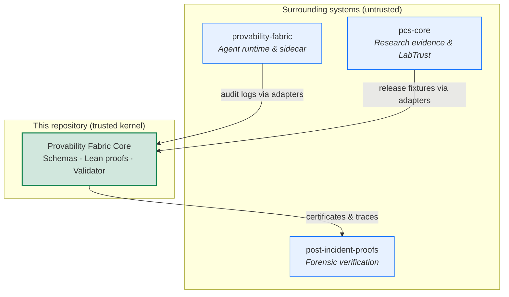
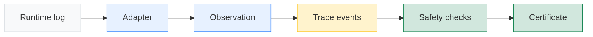

<div align="center">

# Provability Fabric Core

**Machine-checked safety for AI agent actions — from runtime logs to verifiable certificates.**

<br/>

[](https://github.com/SentinelOps-CI/provability-fabric-core/actions/workflows/pf-core-trusted.yml)
[](https://leanprover.github.io/)
[](https://www.python.org/)
[](pf-core/VERSION)

<br/>

[Quick Start](#quick-start) · [How It Works](#how-it-works) · [Ecosystem](#part-of-the-sentinelops-ecosystem) · [Contributing](#contributing) · [Documentation](#documentation)

</div>

---

## What is this?

When an AI agent reads a file, sends an email, or hands work to another agent — **was that action allowed?** Can you prove it later, from logs alone?

**Provability Fabric Core** is a small, auditable foundation for answering those questions. It gives you:

| | |
|---|---|
| **Structured records** | A common format for agent actions, handoffs between agents, and the traces they form |
| **Safety checks** | Rules that verify capabilities, tenant boundaries, and allowed effects on every step |
| **Proofs you can replay** | Lean 4 theorems linked to a Python validator, so certificates mean what they claim |

This repository is the **trusted kernel** — schemas, proofs, and a reference validator. It is not a full agent runtime, policy editor, or deployment platform. The [provability-fabric](https://github.com/SentinelOps-CI/provability-fabric) runtime and other [SentinelOps projects](https://github.com/SentinelOps-CI) build on top of it; see [ecosystem](#part-of-the-sentinelops-ecosystem) below.

> **In one sentence:** turn runtime observations into ordered traces, check them against formal safety rules, and emit certificates backed by machine-checked proofs.

---

## Part of the SentinelOps ecosystem

This repository is maintained by [SentinelOps](https://github.com/SentinelOps-CI) — an open-source organization building formally verified safety infrastructure for AI systems. **Provability Fabric Core is the small, trusted center of that stack.** Everything else wraps around it: runtimes that produce logs, science workflows that publish evidence, and forensic tools that verify bundles after an incident.

Think of the relationship like a kernel and its userspace:



### Related repositories

| Repository | What it does | How it connects here |
|------------|--------------|----------------------|
| [**provability-fabric**](https://github.com/SentinelOps-CI/provability-fabric) | Full agent runtime with behavioral guarantees, sidecar enforcement, and end-to-end audit trails | Emits runtime audit logs. The [`adapters/provability-fabric/`](adapters/provability-fabric/) bridge in this repo normalizes those logs into core schemas for validation and certification. |
| [**pcs-core**](https://github.com/SentinelOps-CI/pcs-core) | Proof-Carrying Science — schemas and tooling for verifiable research and agent evidence | LabTrust release fixtures are mapped to traces via [`adapters/pcs/`](adapters/pcs/) and checked by the kernel validator. |
| [**post-incident-proofs**](https://github.com/SentinelOps-CI/post-incident-proofs) | Transforms runtime telemetry into machine-checked forensic evidence | Consumes certificate and trace artifacts emitted by this kernel to verify bundles cannot be forged or silently altered. |
| [**lean-toolchain**](https://github.com/SentinelOps-CI/lean-toolchain) | Formally verified cryptographic and parsing utilities in Lean 4 | Shared proof infrastructure used across SentinelOps projects. |
| [**runtime-safety-kernels**](https://github.com/SentinelOps-CI/runtime-safety-kernels) | Runtime safety components for model inference with formal proofs | Complementary formal verification work in the same ecosystem. |

Browse all [SentinelOps repositories](https://github.com/SentinelOps-CI) for dataset safety specs, model asset guards, deployment boundary proofs, and more.

### What lives where

| In **this repo** | In **sibling repos** |
|------------------|----------------------|
| Formal safety model and Lean proofs | Agent orchestration and deployment |
| JSON schemas and reference validator | Policy authoring and runtime enforcement |
| Valid/invalid example fixtures | Production sidecars and admission controllers |
| Reference log normalizers (`adapters/`) | Science publishing workflows, forensic bundles |

If you are building on [provability-fabric](https://github.com/SentinelOps-CI/provability-fabric), start there for runtime integration. Come here when you need to understand, extend, or independently verify the safety kernel underneath.

---

## How it works



| Component | Location | What it does |
|-----------|----------|--------------|
| **Schemas** | `pf-core/schemas/` | JSON formats for observations, events, traces, and certificates |
| **Validator** | `pf-core/validator/` | CLI that compiles, validates, checks safety, and emits artifacts |
| **Lean proofs** | `pf-core/lean/PFCore/` | Machine-checked theorems: runtime checks match the formal model |
| **Examples** | `pf-core/examples/` | Paired valid and invalid fixtures — every success has a failure twin |
| **Adapters** | `adapters/` | Optional bridges from real runtime logs into core formats |

Every safety predicate in the formal model has a matching runtime decider, with a soundness proof connecting the two.

---

## Quick start

### Prerequisites

- [Lean 4](https://leanprover.github.io/) via [elan](https://github.com/leanprover/elan)
- Python 3.10+

### Run the full verification gate

This runs Lean proofs, schema validation, example fixtures, a boundary audit, and unit tests.

**Linux / macOS**

```bash
make pf-core-trusted
```

**Windows (PowerShell)**

```powershell
powershell -File pf-core/scripts/pf-core-trusted.ps1
```

### Try the CLI

```bash
pip install -e pf-core/validator

# Validate schema files
pf core schema-check --schemas pf-core/schemas

# Compile a runtime observation into a trace event
pf core compile-observation \
  --file pf-core/examples/valid/mcp_sidecar_observation.json

# Check an entire trace for safety violations
pf core check-trace \
  --file pf-core/examples/valid/file_read_allowed_trace.json

# Emit a certificate for a safe trace
pf core emit-certificate \
  --trace pf-core/examples/valid/file_read_allowed_trace.json
```

New to the project? The [hands-on tutorial](docs/pf-core/tutorial.md) walks through the pipeline without requiring Lean.

---

## Repository layout

```
provability-fabric-core/
├── pf-core/
│   ├── lean/PFCore/       Formal model and proofs (Lean 4)
│   ├── schemas/           JSON schema definitions
│   ├── examples/          Valid and invalid test fixtures
│   ├── validator/         Python CLI and runtime bridge
│   └── docs/              Technical deep-dives
├── adapters/              Reference log normalizers (outside trusted core)
├── docs/pf-core/          Guides, tutorials, and boundary documentation
└── scripts/               CI helpers and cross-repo smoke tests
```
