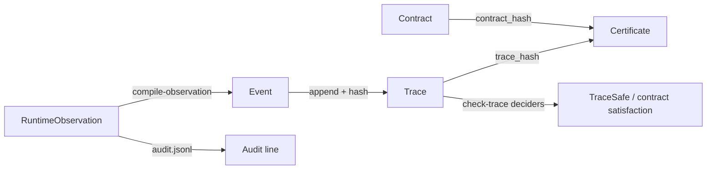

# PF-Core Runtime Mapping

Pipeline from runtime observation to certificate.

## Flow

## Stages

| Stage | Input | Output | Checker |
|-------|-------|--------|---------|
| Schema validation | JSON file | kind inference | `pf core schema-check`, `validate_object` |
| Compile | `runtime_observation` | `event` | `compile.py` (deterministic, A6) |
| Hash chain | `event` / `trace` | validated digests | `hash_chain.py` (assumes A2) |
| Safety deciders | `event` / `trace` | boolean | `deciders.py` (T4; soundness T1) |
| Optional Lean replay | golden trace | `PFCore.Replay` build | `pf core check-trace --lean-check` or `lean-check-trace.sh` |
| Contract satisfaction | `contract` + `trace` | boolean / errors | `contracts.py` (T4) |
| Observation contract pre | `contract` + `observation` | policy/evidence refs | `contracts.py` at emit time |
| Certificate emit | `trace` + `contract` | `certificate` | `emitter.py` |

## T1 replay vs T4 decider split

| Ring | Component | What it proves |
|------|-----------|----------------|
| **T1 (Lean)** | `Replay.lean`, `Soundness.lean` | Decider soundness on golden traces; optional `--lean-check` in e2e |
| **T4 (runtime)** | `deciders.py`, `contracts.py` | Executable safety on every trace in CI |
| **T5 (organizational)** | Adapter catalog JSON, policy refs | Catalog completeness; not in Lean TCB |

Lean replay runs only on **release goldens** (`file_read_allowed_trace.json`, `handoff_trace.json`, `pcs_replay_trace.json`) for performance. All traces still pass Python deciders in `check-trace`.

## Field mapping (observation to event)

| Observation field | Event / action field |
|-------------------|----------------------|
| `principal_id` | `action.principal.id` |
| `tenant_id` | `action.principal.tenant_id`, `action.resource.tenant_id` |
| `effect_kind` | `action.effect.kind` |
| `resource_uri` | `action.resource.uri` |
| `capability_id` | resolved via `CAPABILITY_CATALOG` |
| `decision` | `decision` (may downgrade to `denied` if action unsafe) |
| `previous_event_hash` | `previous_event_hash` |
| `policy_ref` / `evidence_ref` | checked against contract `pre` at emit; not stored on event |

## Lab release gate mapping

`lab-release-gate` contract preconditions:

| Contract field | Operational meaning |
|----------------|---------------------|
| `require_capability: cap:lab-release` | Agent holds release capability |
| `require_effect: lab.release` | Effect allowlist |
| `require_policy_ref: policy/lab-gate.v0` | Stability window policy bundle (organizational) |
| `require_evidence_ref: evidence/lab-signoff.v0` | QC sign-off evidence pointer (organizational) |

Post: `require_decision: allowed` and `require_event_safe: true`. Invariant: `require_trace_safe: true`.

## What this pipeline does not prove

- Observation fidelity (A1)
- Correct tenant labels (A3)
- Completeness of capability catalog (A4)
- Semantic content of policy or evidence blobs
- LLM or tool honesty
