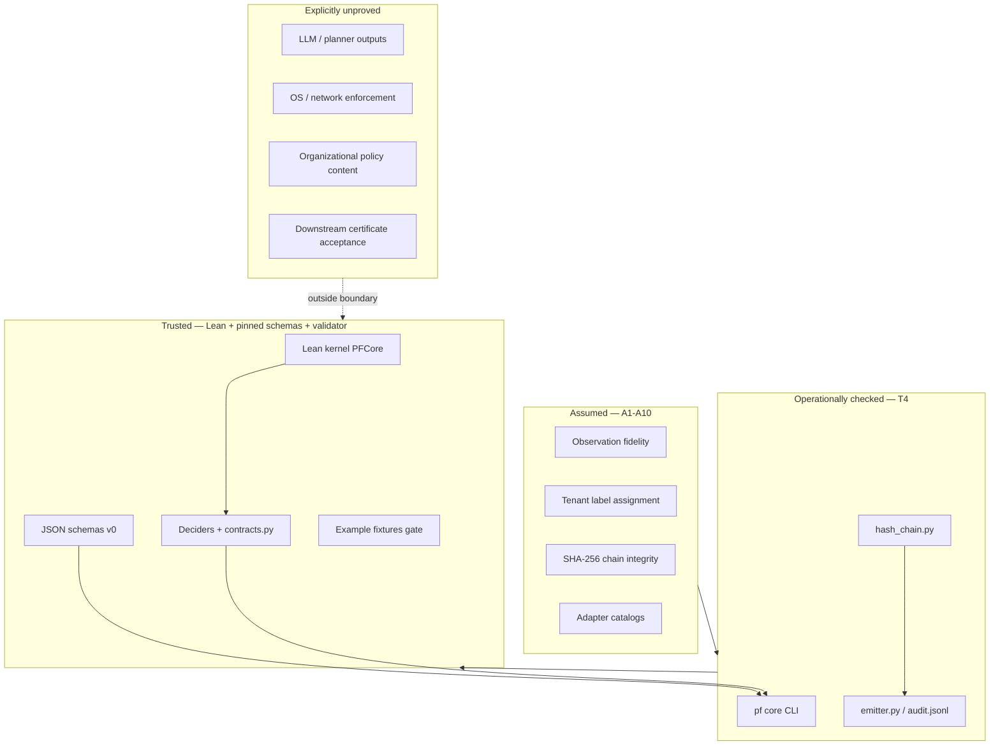

# PF-Core Trusted Rings

Partition of the PF-Core stack by proof and enforcement status.

## Ring definitions

| Ring | Contents | Evidence |
|------|----------|----------|
| **Trusted** | Lean theorems, schemas, decider soundness, contract algebra | `lake build`, `make pf-core-trusted` |
| **Operationally checked** | CLI commands, hash validation, compile determinism | Validator modules, fixture tests |
| **Assumed** | Emitter honesty, hash linking, tenant labels, catalogs | `docs/pf-core/assumptions.md` |
| **Unproved** | External systems, semantic policy, deployment safety | `mission.md`, `claim-boundary.md` |

## Lean vs runtime contract split

- **Lean `Contract`**: arbitrary `Prop` pre/post/invariant; proved algebra (`seq`, satisfaction).
- **JSON `contract`**: conservative structured fields executable by `contracts.py`.
- **Gap**: JSON contracts do not encode arbitrary Lean `Prop`; mapping is intentional and documented.
